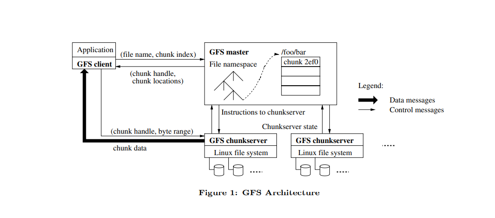
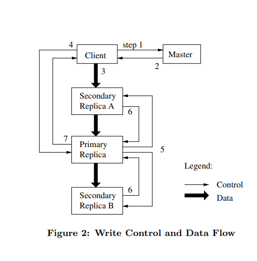

# Google File System
A distributed file system where we can upload, add and retrieve files. The file system consists of master server and chunkservers and can be accessed by multiple clients. A file is broken down into multiple chunks and stored in different chunkservers.
This project is a mini version of Google File System that has been implemented from scratch based on [this](https://static.googleusercontent.com/media/research.google.com/en//archive/gfs-sosp2003.pdf) research paper.

---

## GFS Architecture


The filesystem consists of Single Master Server and Multiple Chunk Servers where data is stored and Multiple Clients can be connected for data updation and retrieval

1. #### Master Server :
- The filesystem consists of a single master server, which is responsible for storing the file, offset and chunk metadata(chunk handle, chunkserver locations)
- When the client wants to read or write in the file, it first connects with master server which gives the chunk handle and chunkservers locations
- It maintains in memory mapping of the file, offset, chunk handle and chunk metadata.
- It also establishes connections with chunkservers and maintains heartbeat of chunkservers. On a regular interval, the heartbeat of chunkservers are checked and chunkservers are removed from the system if heartbeat is not received for sometime.
- While writing a new file, lease is also assigned by the master to a specific chunkserver to maintain the integrity of data while replication.

2. #### Chunk Server :
- The chunkservers consist of actual chunks(file data) stored.
- After getting the chunkserver locations from master server, client connects with chunkservers for data transfer.
- The chunkservers also send hearbeat to master at regular intervals so that the master is aware that the chunkserver is active.

3. #### Client Server :
- Multiple client servers can connect with the master and chunkservers. 
- Client servers are the starting point of a request, which can be READ OR WRITE.

--- 

### Control Flow : 


---
### Steps to run
1. All the different servers - master, chunkserver, client should run in different ports.
2. We can even run multiple chunkservers simultaneously. Just the port and the application.properties needs to be changed for that.
- To override system properties defined in application.propperties file :
```mvn spring-boot:run -Dspring-boot.run.arguments=--<property_name>=<property_value> ```  
Eg.  
```mvn spring-boot:run -Dspring-boot.run.arguments=--chunkserver.port=8020```

- To run multiple chunkservers, deploy and run :
```java -jar <jar_file_path> <main_class_path> --spring.config.location=src/main/resources/chunkserver<1/2/3>.properties```

---
#### Other Distributed System Features Implemented : 
1. Heartbeat
2. Replication
3. Leasing for a chunkserver

---
#### Future Goals 

1. Async sending of ack write requests
2. Support appending and deletion of a file
